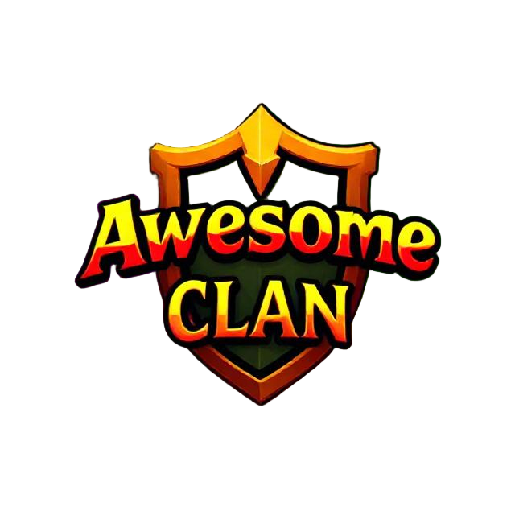

# AwesomeClan



Keeps the AwesomeClan roster synced with the clan website, and can show your
XP and boss kills live on your dashboard account page while you're playing,
instead of waiting for the next hiscores refresh.

Both features need a personal token: generate one from your account page on
the dashboard (Member portal → Profile) and paste it into this plugin's
settings. One token covers everything — roster sync, live data, and any
linked alts. Without a token configured, the plugin does nothing; it never
sends requests it knows will be rejected.

Once configured: roster sync runs every 20-30 minutes (randomized per client
so a few hundred members don't all sync at once), and live data sends
batched updates (never more than once every ~15s) for as long as you're
logged in.

## Development

```
./gradlew run
```

This launches a local RuneLite client with the plugin loaded, per the
[Plugin Hub development guide](https://github.com/runelite/plugin-hub#developing-plugins).
