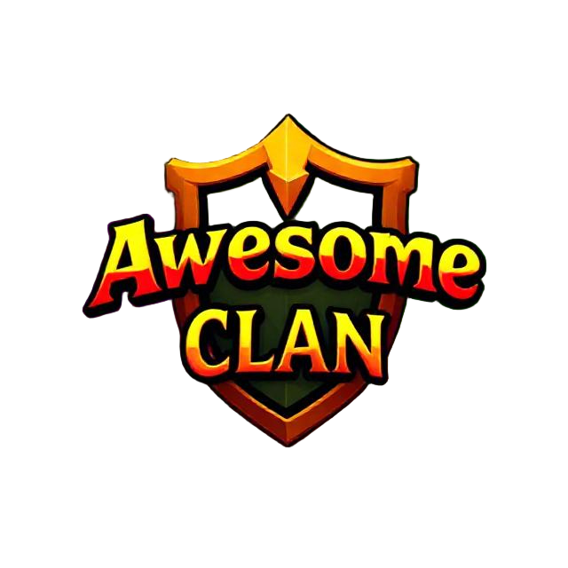

# AwesomeClan

Keeps the AwesomeClan roster synced with the clan website and shows your XP
and boss kills live on the dashboard while you play, so you don't have to wait
for the next hiscores refresh. It also picks up kick, recruit and coffer
broadcasts from clan chat so the website can log them.

You need a personal token for any of this. Generate one on the dashboard
(Member portal > Profile) and paste it into the plugin settings. If you play
alts, put each account's token on its own line. With no token set the plugin
doesn't send anything.

Roster sync runs every 20-30 minutes. Live data goes out in batches about
every 15 seconds while you're logged in.

There's also a "Relay clan chat" option, off by default. Turning it on sends
the AwesomeClan clan chat and clan broadcasts you see to the dashboard so staff
can read them there. Public chat and PMs are never sent.
